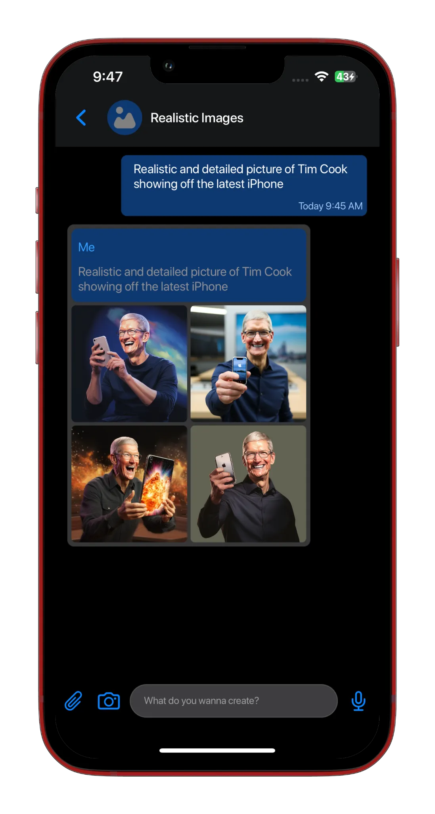
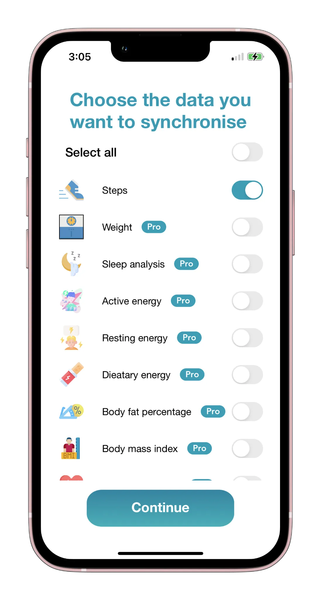
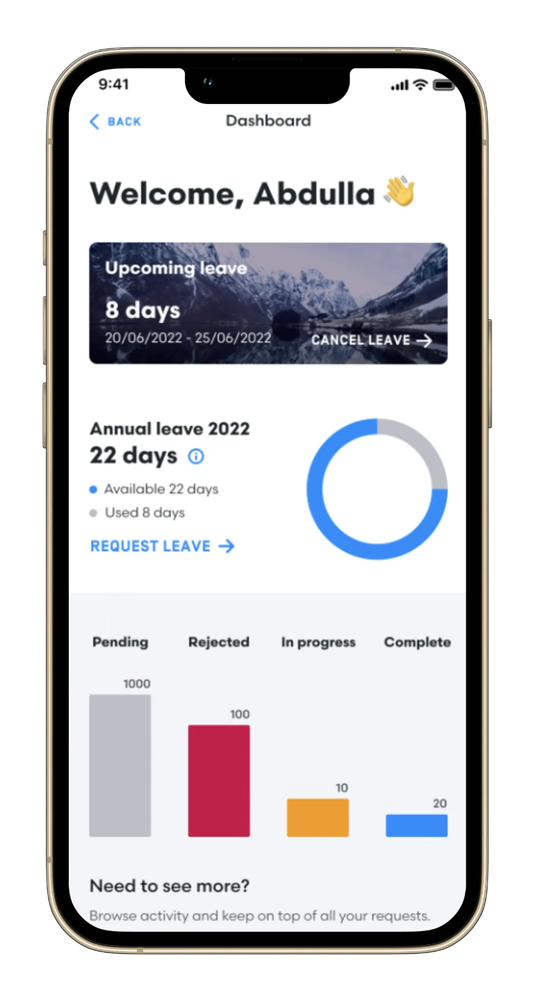
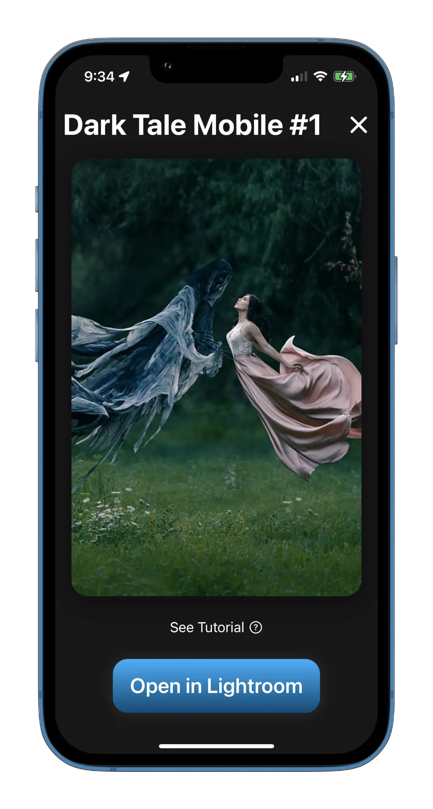
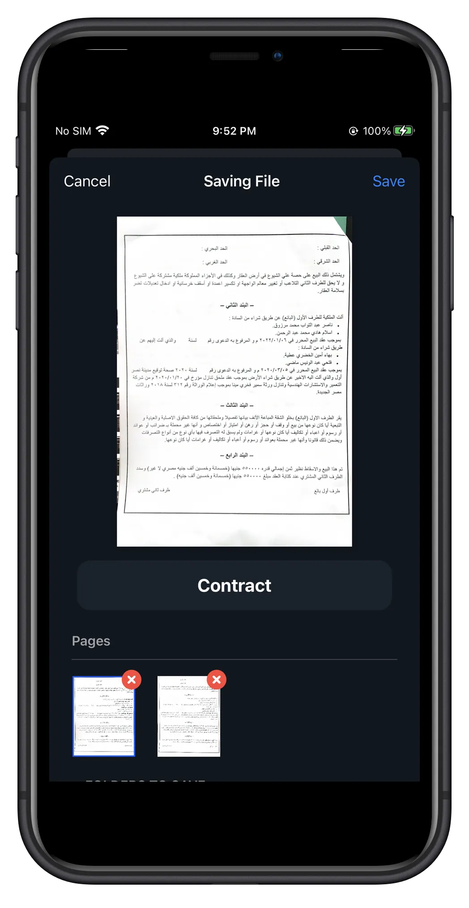
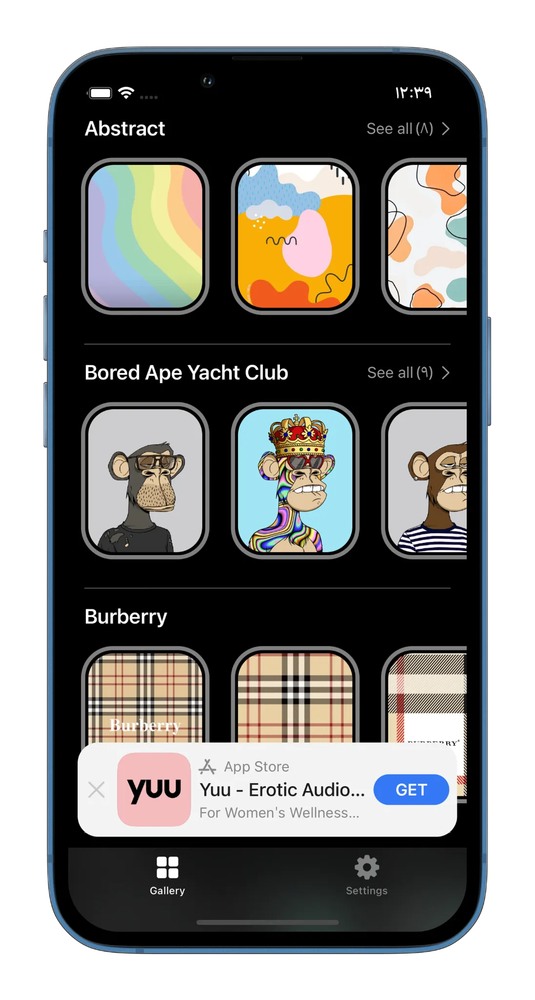
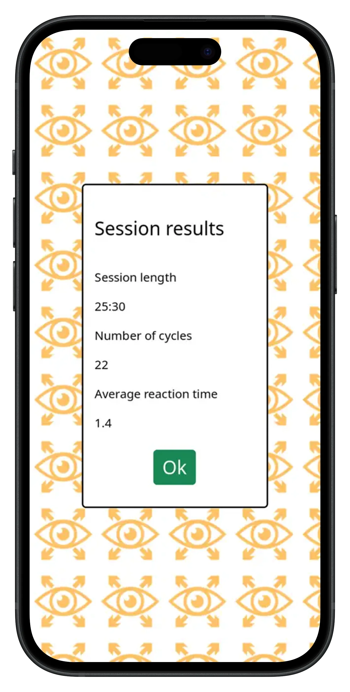

    <!-- Hero -->
  <section class="hero hero-centered">

  

  <h1 class="hero-name">Marwan Osama</h1>
  <h2 class="hero-role">Senior iOS Developer</h2>

  

      Senior iOS Developer with 5+ years of experience building scalable,
      high-quality iOS applications using Swift, SwiftUI, and UIKit.
       
      Focused on clean architecture, modular systems, and performance-driven solutions
      for enterprise and consumer products.
    

  

      <a
        href="https://www.linkedin.com/in/marwanosama1997/"
        class="hero-action"
        aria-label="LinkedIn"
      >
        <i class="fa-brands fa-linkedin-in"></i>
      </a>

  <a
        href="https://github.com/marwansultan97"
        class="hero-action"
        aria-label="GitHub"
      >
        <i class="fa-brands fa-github"></i>
      </a>

  <a
        href="mailto:marwansultan97@gmail.com"
        class="hero-action"
        aria-label="Email"
      >
        <i class="fa-solid fa-envelope"></i>
      </a>

  <a
        href="https://www.upwork.com/freelancers/~017a3a1dd6676253d8"
        class="hero-action"
        aria-label="Upwork"
      >
        <i class="fa-brands fa-upwork"></i>
      </a>
    

  </section>

<!-- Projects -->
  <section class="section">
    <h2>Projects</h2>
    
Some of the applications I have built, maintained, and published.

  

      

<a href="projects/Thiqati.html" class="project-link">
  

    
    

      <h3>Thiqati</h3>
      

        Thiqati is an Enterprise platform streamlining employee operations, engagement, and internal communication.
      

      
<strong>Category:</strong> Enterprise / Internal Operations

      
<strong>Tech:</strong> UIKit · MVVM / Clean Architecture · Azure Cloud Messaging · Asynchronous Programming · Security & Data Privacy

    

  

</a>

    
  <a href="projects/AtWork" class="project-link">
  

    
    

      <h3>AtWork</h3>
      

        Enterprise indoor navigation platform enhancing workplace efficiency and sustainability.
      

      
<strong>Category:</strong> Enterprise / Smart Workplace

      
<strong>Tech:</strong> UIKit · MappedIn · Geospatial Mapping · Azure Cloud Messaging · Datadog

    

  

</a>

    
  <a href="projects/WhatPhoto.html" class="project-link">
  

    
    

      <h3>WhatPhoto – AI Art Generator</h3>
      

        AI-powered iOS app that turns text, images, and voice into artwork.
      

      
<strong>Category:</strong> Consumer / AI & Creativity

      
<strong>Tech:</strong> UIKit · AI Image Generation · In-App Purchases · Speech Recognition · Firebase

    

  

</a>

    
  <a href="projects/Nippur.html" class="project-link">
  

    
    

      <h3>Nippur Academy</h3>
      

        E-learning app delivering structured courses with secure, high-quality video playback.
      

      
<strong>Category:</strong> Education / E-Learning

      
<strong>Tech:</strong> UIKit · Custom Video Player · Secure Media Streaming · AVFoundation

    

  

</a>

    
  <a href="projects/FitSync" class="project-link">
  

    
    

      <h3>FitSync</h3>
      

        Bridge Fitbit and Apple Health with daily and bulk health data syncing.
      

      
<strong>Category:</strong> Health & Fitness

      
<strong>Tech:</strong> UIKit · HealthKit · CSV Processing · In-App Purchases · Firebase

      

          ★★★★★
          4.5
          (App Store Rating)
        

    

  

</a>

<a href="projects/Importfolio.html" class="project-link">
  

    
    

      <h3>Importfolio</h3>
      

        Build and manage a personal portfolio with projects, experience, and achievements.
      

      
<strong>Category:</strong> Productivity / Developer Tools

      
<strong>Tech:</strong> UIKit · MVVM · Firebase Database · Firebase Storage · Firebase Analytics

    

  

</a>
    
  <a href="projects/CaptionAI.html" class="project-link">
  

    
    

      <h3>CaptionAI</h3>
      

        AI-powered subtitle generator with video recording and editing tools for creators.
      

      
<strong>Category:</strong> Media / AI & Creator Tools

      
<strong>Tech:</strong> SwiftUI · UIKit · OpenAI Whisper · In-App Purchases

    

  

</a>

  <a href="projects/SlowMo.html" class="project-link">
  

    
    

      <h3>SlowMo</h3>
      

        Video editing app with custom speed ramping and media tools.
      

      
<strong>Category:</strong> Media / Video Editing

      
<strong>Tech:</strong> SwiftUI · UIKit · AVFoundation · In-App Purchases

    

  

</a>

  <a href="projects/Mobily.html" class="project-link">
  

    
    

      <h3>mCan (Mobily)</h3>
      

        mCan is an enterprise app streamlining employee tasks, service requests, and internal communication at Mobily.
      

      
<strong>Category:</strong> Enterprise / Telecom

      
<strong>Tech:</strong> UIKit · RxSwift · MVVM · Dynamic Forms · Firebase Analytics

    

  

</a>

    
  <a href="projects/LRPresets.html" class="project-link">
  

    
    

      <h3>LRPresets</h3>
      

        Discover, preview, and export photo presets to Lightroom.
      

      
<strong>Category:</strong> Photography / Creative Tools

      
<strong>Tech:</strong> SwiftUI · Firebase · In-App Purchases · Alamofire · Lightroom Integration

    

  

</a>

    
  <a href="projects/ScanPDF.html" class="project-link">
  

    
    

      <h3>Scan PDF</h3>
      

        Scan documents, enhance images, extract text, and export PDFs.
      

      
<strong>Category:</strong> Productivity / Document Management

      
<strong>Tech:</strong> SwiftUI · VisionKit · PDFKit · Firebase · In-App Purchases

    

  

</a>

<a href="projects/Kudos.html" class="project-link">
  

    
    

      <h3>Watch Faces & Widget Gallery</h3>
      

        Browse and customize thousands of Apple Watch faces and widgets with one-tap setup.
      

      
<strong>Category:</strong> Lifestyle / Personalization

      
<strong>Tech:</strong> SwiftUI · Firebase · In-App Purchases

      

          ★★★★★
          4.7
          (App Store Rating)
        

    

  

</a>

<a href="projects/Eye-Opener.html" class="project-link">
  

    
    

      <h3>Eye-Opener</h3>
      

        Wellness app that trains peripheral vision to reduce eye and mental strain.
      

      
<strong>Category:</strong> Health & Wellness / Focus

      
<strong>Tech:</strong> UIKit · RxSwift · MVC · Firebase Analytics

    

  

</a>
      

    

  </section>
 

  <!-- Technical Skills -->
  <section class="section">
    <h2>Technical Skills</h2>

  

      

        <h3>💻 Programming languages</h3>
        
Swift

      

  

        <h3>🤖 iOS Frameworks & APIs</h3>
        
UIKit, SwiftUI, Core Data, Core Animation, Core Graphics, AVFoundation, MapKit, Foundation

      

  

        <h3>🏛️ Architectures & Design Patterns</h3>
        
MVVM, MVC, Clean Architecture, SOLID Principles, Protocol-Oriented Programming

      

  

        <h3>{ } Networking & Data</h3>
        
RESTful APIs, URLSession, JSON, Codable, OAuth, API Integration

      

  

        <h3>🔧 Tools & Developer Utilities</h3>
        
Xcode, Git, CocoaPods, Swift Package Manager (SPM), Instruments

      

  

        <h3>🐞 Testing & Quality</h3>
        
Debugging, Performance Profiling, Memory Leak Detection, Crash Analysis

      

  

        <h3>👥 Development Practices</h3>
        
Agile, Scrum, Code Reviews, CI/CD Collaboration, App Store Deployment

      

  

        <h3>📖 Other Skills</h3>
        
Third-Party SDK Integration, Modularization, Dependency Injection, Problem Solving, Clean Code

      

    

  </section>

  <!-- Impact -->
  <section class="section">
  <h2>Impact Snapshot</h2>
  <ul class="impact-list">
    <li>10+ iOS applications shipped to production</li>
    <li>Apps used by thousands of users across enterprise and consumer markets</li>
    <li>Worked on consumer apps with 12k+ ratings and 4.5★ average App Store score</li>
    <li>Built and maintained long-lived codebases with continuous feature delivery</li>
    <li>Hands-on experience with performance optimization and memory profiling</li>
    <li>Shipped features end-to-end from architecture to App Store release</li>
  </ul>
</section>

<!-- How I Work -->
<section class="section">
  <h2>How I Work</h2>
  <ul class="how-i-work-list">
    <li>I prioritize clean architecture and long-term maintainability</li>
    <li>I design features with performance and scalability in mind</li>
    <li>I value clear communication, ownership, and collaboration</li>
    <li>I’m comfortable working on both greenfield and legacy codebases</li>
  </ul>
</section>

