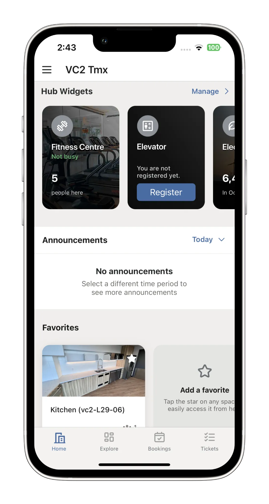
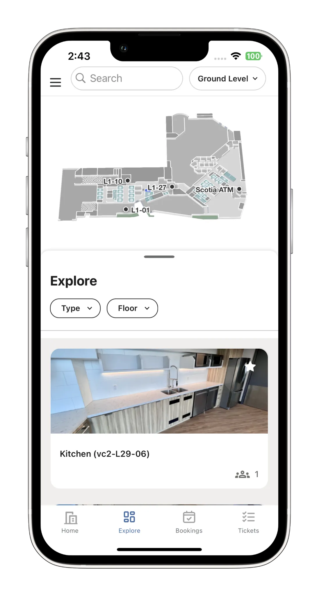
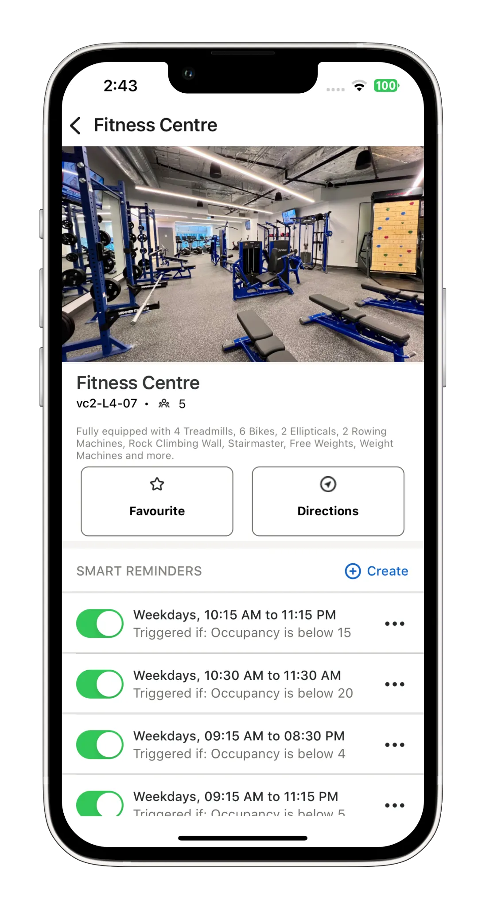
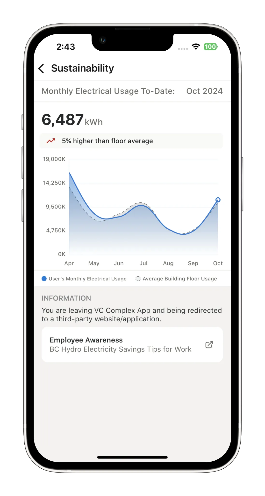
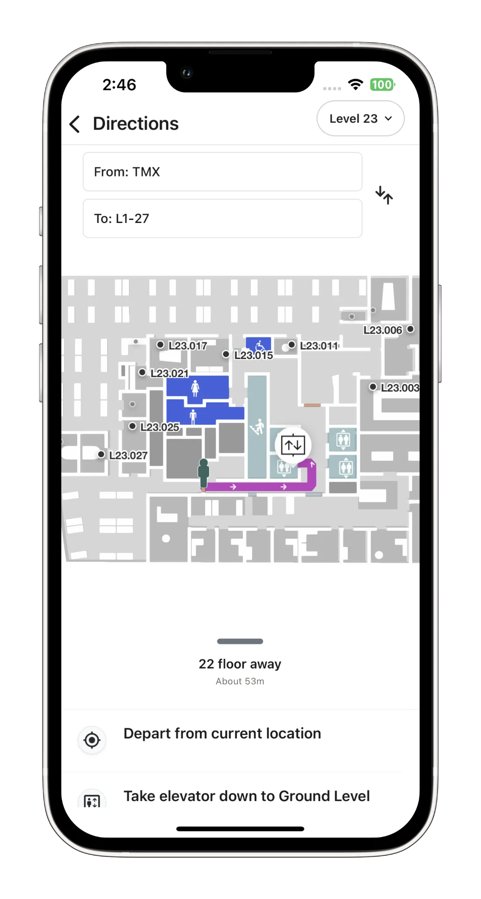
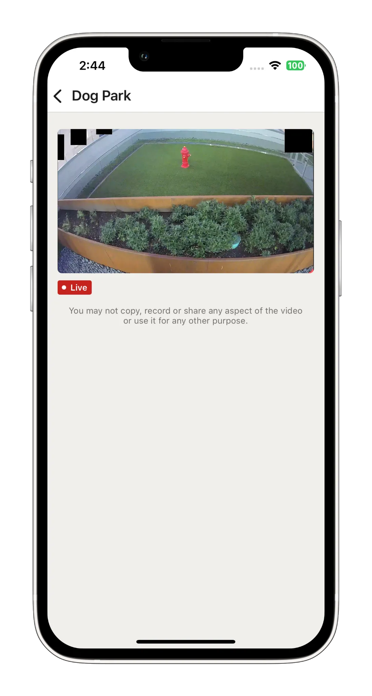

## AtWork

**Category:** Enterprise / Smart Workplace 

**AtWork** is an advanced indoor navigation iOS application designed for enterprise environments to improve workplace efficiency and promote sustainability. The app enables employees and visitors to seamlessly navigate across company buildings, floors, and rooms using interactive indoor maps powered by MappedIn.

Beyond navigation, AtWork integrates smart workplace features such as meeting room booking, real-time indoor camera streaming, and energy consumption monitoring across different areas—helping organizations optimize space usage and encourage energy-saving practices. access to company-approved and licensed tools—including paid applications and AI-based services tailored for internal use.

---

## 📱 Screenshots

  
  
  
  
  
  

<section id="tech" class="tech-section">
  <h2>🧰 Technology Stack</h2>
  

    UIKit
    Dependency Injection
    MappedIn Framework
    Datadog (performance monitoring and analysis)
    Indoor Geospatial Interactions
    URLSession / RESTful APIs
    Microsoft Authentication
    Push Notifications
    MVVM / Clean Architecture
    Floor and room-level navigation
    Room Booking System
  

</section>

---

<section id="features" class="features-section">
  <h2>⭐ Key Features</h2>
  <ul class="features-list">
    <li>Indoor navigation across buildings, floors, and rooms</li>
    <li>Interactive geospatial maps powered by MappedIn</li>
    <li>Meeting room discovery and booking system</li>
    <li>Energy consumption monitoring by area and floor</li>
    <li>Integration with internal camera streaming for live views</li>
    <li>Real-time notifications and updates</li>
    <li>Enterprise-focused performance monitoring and analytics</li>
    <li>Company announcements, news, and exclusive offers</li>
    <li>Secure authentication and enterprise-grade data privacy</li>
    <li>Modular architecture for scalability and maintainability</li>
  </ul>
</section>
