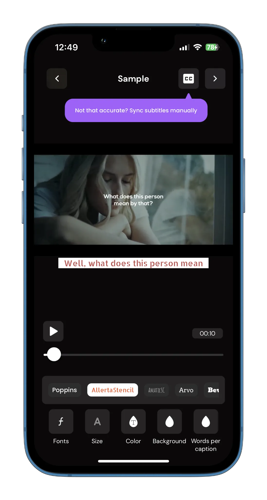
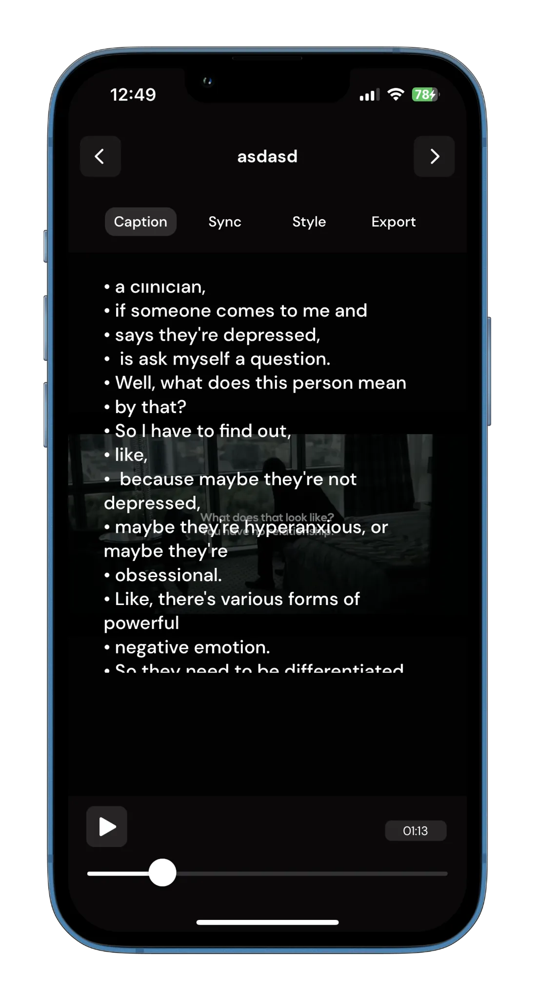
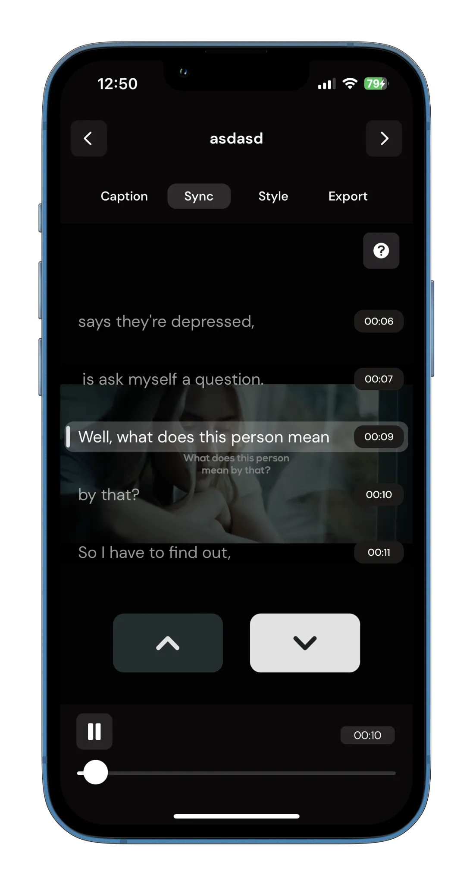
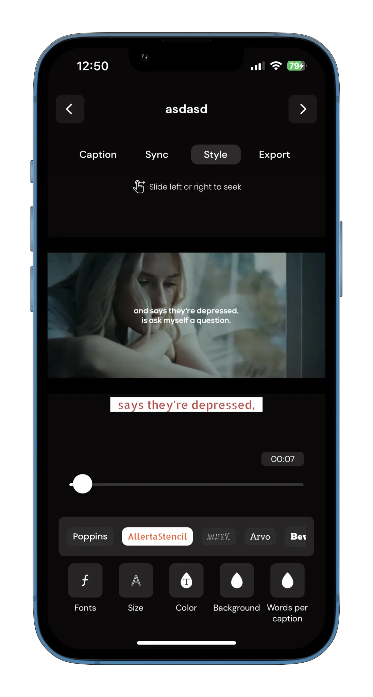
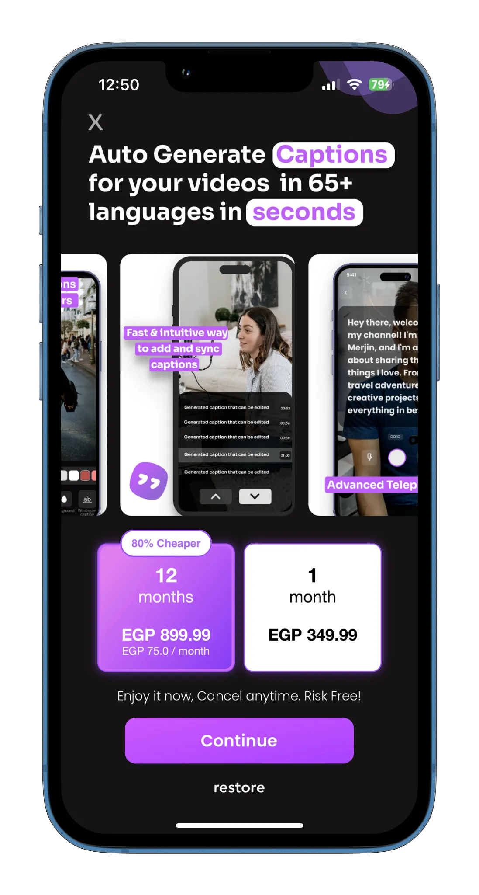

## CaptionAI

**Category:** Media / AI & Creator Tools

**CaptionAI** is an AI-powered iOS application designed for content creators to generate subtitles, record short-form videos, and produce polished final outputs directly on their device. The app automatically detects the spoken language in videos and generates subtitles using advanced AI transcription models.

Inspired by workflows used in platforms like YouTube Shorts and Instagram Reels, CaptionAI allows users to record multiple short video clips and seamlessly combine them into a single video—while maintaining full control over subtitles, timing, and visual styling.

---

## 📱 Screenshots {#screenshots}

  
  
  
  
  
  

<section id="tech" class="tech-section">
  <h2>🧰 Technology Stack</h2>
  

    UIKit
    SwiftUI
    OpenAI Whisper Integration
    Short-Form Video Recording
    Multi-Clip Video Merging
    Subtitle Generation & Editing
    Audio & Video Processing
  

</section>

<section id="features" class="features-section">
  <h2>⭐ Key Features</h2>
  <ul class="features-list">
    <li>Automatic subtitle generation with language detection</li>
    <li>AI-powered transcription using OpenAI Whisper</li>
    <li>Record multiple short video clips and merge them into a single video</li>
    <li>Short-form video workflows similar to YouTube and Instagram Reels</li>
    <li>Full subtitle customization: font, color, size, background, and layout</li>
    <li>Manual subtitle editing with precise time synchronization</li>
    <li>Built-in teleprompter for guided video recording</li>
    <li>Video merging, processing, and export</li>
    <li>Premium features unlocked via in-app purchases</li>
  </ul>
</section>

