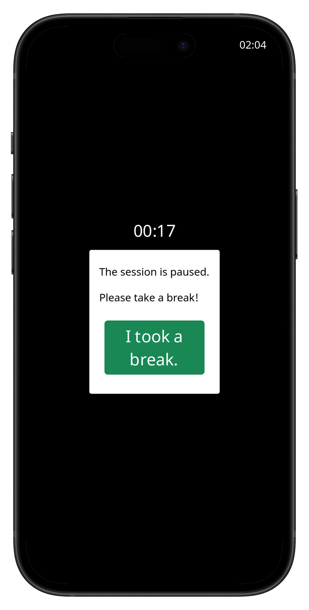
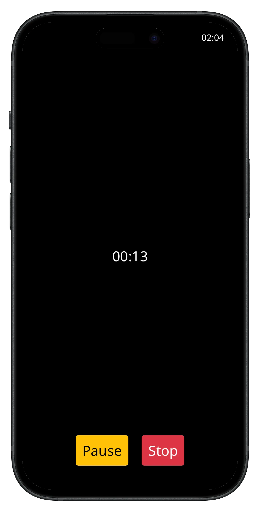
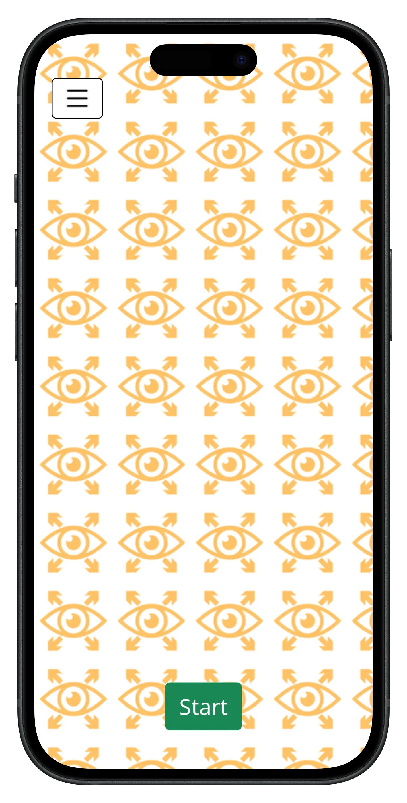
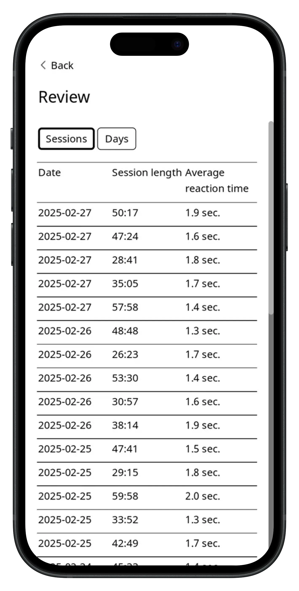
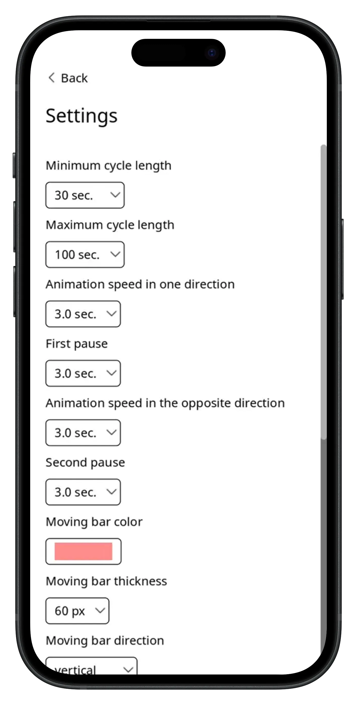

## Eye-Opener

**Category:** Health & Wellness / Focus

[ View on App Store →](https://apps.apple.com/eg/app/eye-opener/id1629132436)

**Eye-Opener** is a lightweight iOS application designed to help users expand their peripheral vision and reduce eye, neck, and mental tension caused by prolonged focused work. When working on a computer or reading, users often fixate on a narrow visual area, which can lead to strain and fatigue over time.

The app encourages a healthier visual habit by displaying subtle moving visual cues in the user’s peripheral vision. By responding to these cues while continuing their primary task, users gradually retrain their visual awareness and improve overall comfort during long work sessions.

---

## 📱 Screenshots {#screenshots}

  
  
  
  
  
  

<section id="tech" class="tech-section">
  <h2>🧰 Technology Stack</h2>
  

    UIKit
    Animation & Timing Engine
    Core Animation
    Reaction Detection Logic
    Visual, Sound & Haptic Feedback
  

</section>

<section id="features" class="features-section">
  <h2>⭐ Key Features</h2>
  <ul class="features-list">
    <li>Peripheral vision training through subtle animated cues</li>
    <li>Configurable reaction-based interaction cycles</li>
    <li>Visual and haptic feedback when reaction time is exceeded</li>
    <li>Fully customizable animation behavior (cycle length, speed, direction, pauses, color, and thickness)</li>
    <li>Multiple reaction trigger modes (e.g., disappearance or direction change)</li>
    <li>Adjustable reaction time thresholds</li>
    <li>Break reminders at configurable intervals</li>
    <li>Minimal, distraction-free UI</li>
  </ul>
</section>

