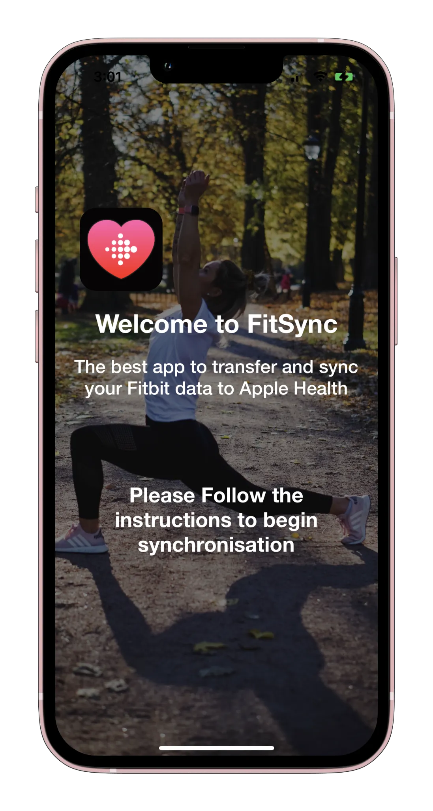
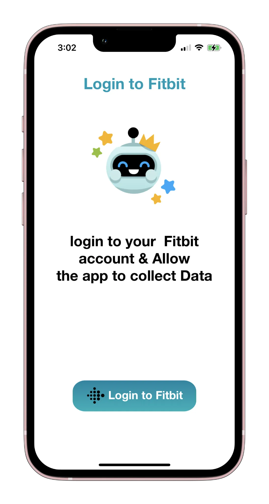
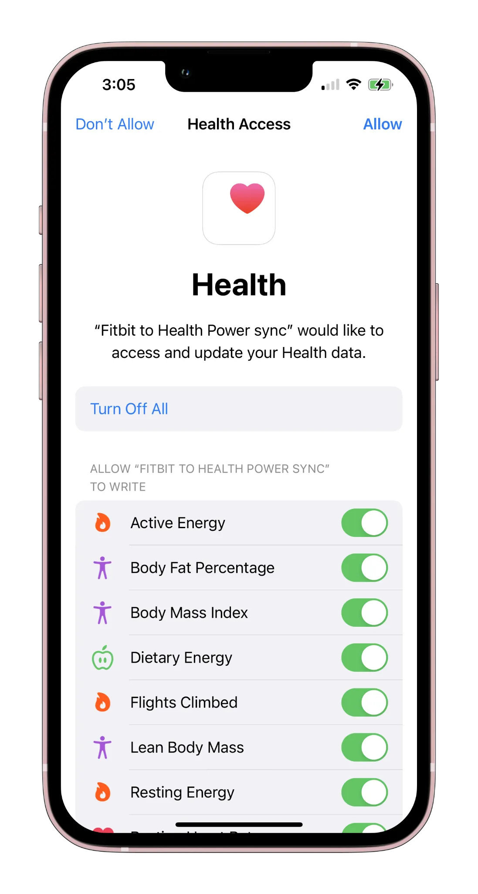
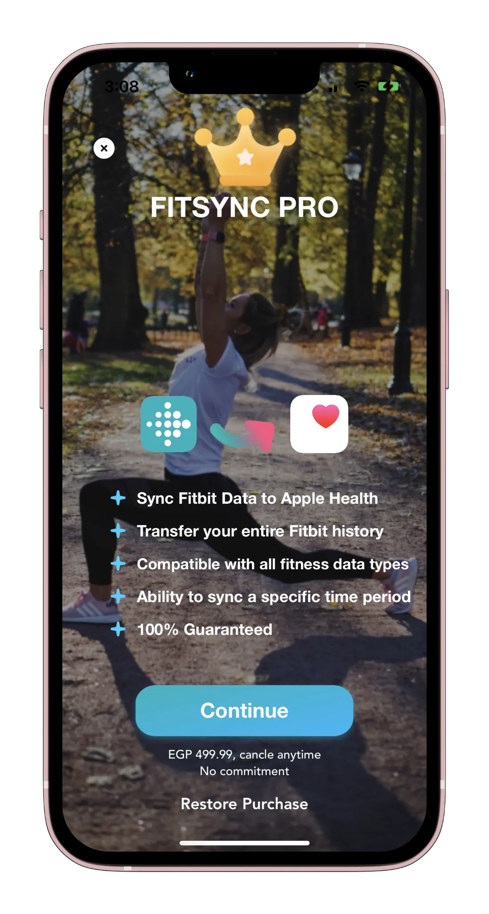

## FitSync

**Category:** Health & Fitness

[ View on App Store →](https://apps.apple.com/us/app/power-sync-fitness-to-health/id1642814856)

  ★★★★★
  4.5
  (+12k ratings)

**FitSync** is an iOS application that enables users to seamlessly synchronize health data from the Fitbit platform into Apple Health. The app supports both day-by-day syncing and large-scale bulk imports—allowing users to transfer monthly or annual health data using CSV files exported from Fitbit.

With a strong user base and high App Store ratings, FitSync focuses on reliability, performance, and accurate health data mapping, providing users with full control over their health history across platforms.

---

## 📱 Screenshots {#screenshots}

  
  
  
  
  
  

<section id="tech" class="tech-section">
  <h2>🧰 Technology Stack</h2>
  

    UIKit
    HealthKit
    Health Data Samples Processing
    CSV Parsing & Processing
    URLSession / RESTful APIs
    In-App Purchases
    Firebase Cloud Messaging
  

</section>

<section id="features" class="features-section">
  <h2>⭐ Key Features</h2>
  <ul class="features-list">
    <li>Sync Fitbit health data into Apple Health</li>
    <li>Day-by-day health data synchronization</li>
    <li>Bulk data import using CSV files (monthly / annual)</li>
    <li>Accurate mapping of Fitbit data samples to HealthKit</li>
    <li>Secure handling of sensitive health data</li>
    <li>Premium features unlocked via in-app purchases</li>
    <li>Push notifications for sync updates and status</li>
    <li>Analytics to monitor user engagement and sync behavior</li>
  </ul>
</section>

