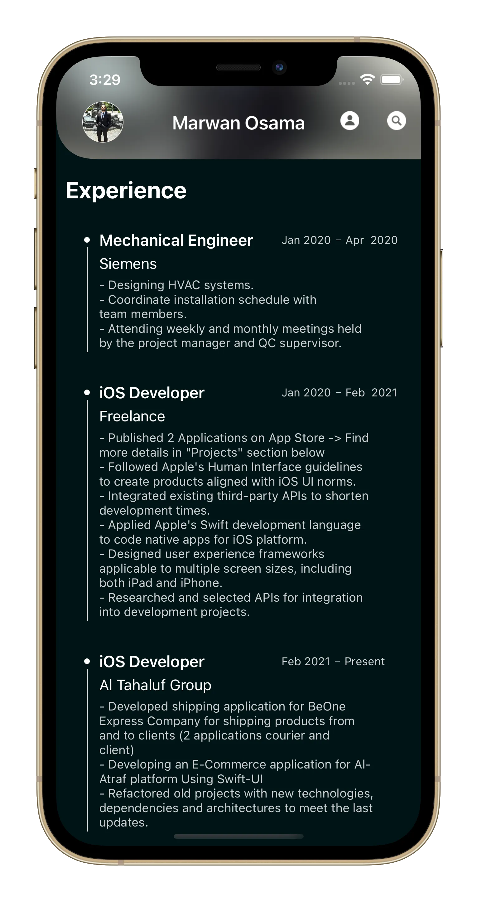
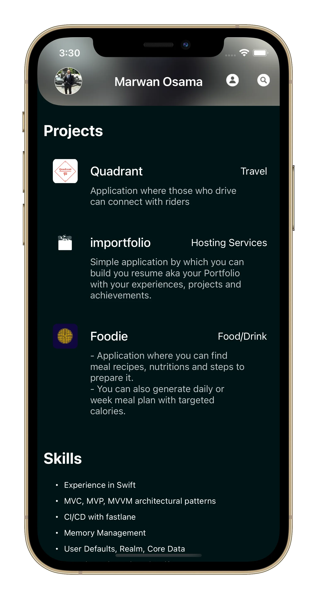
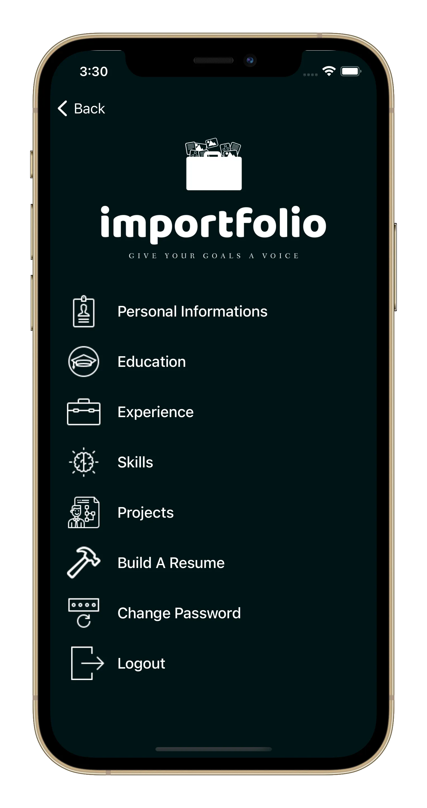
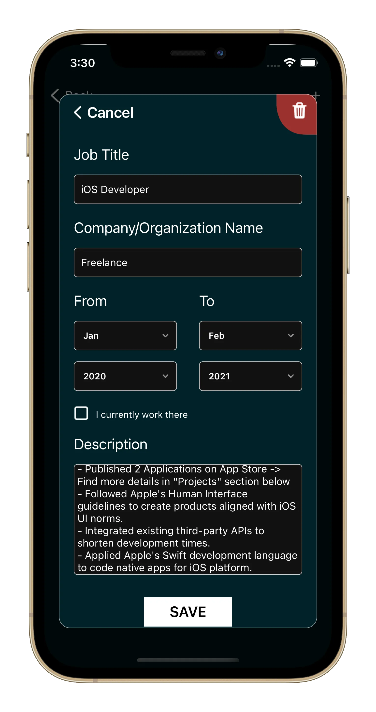
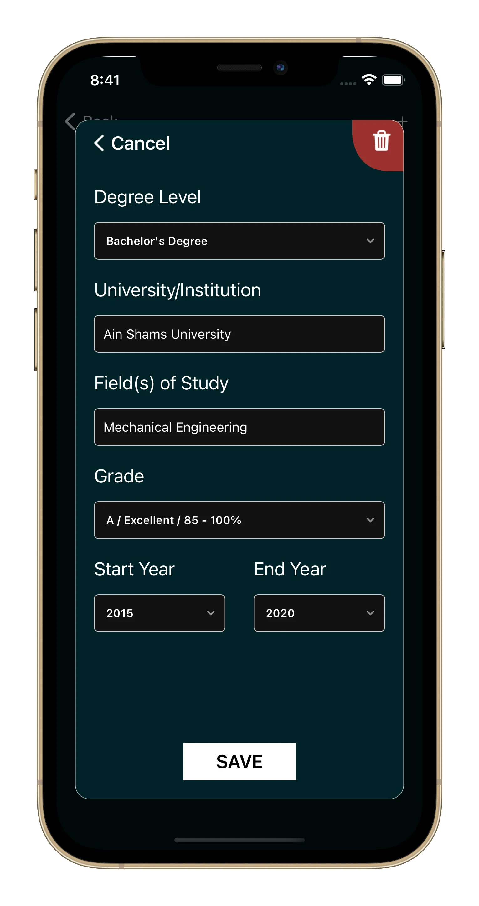
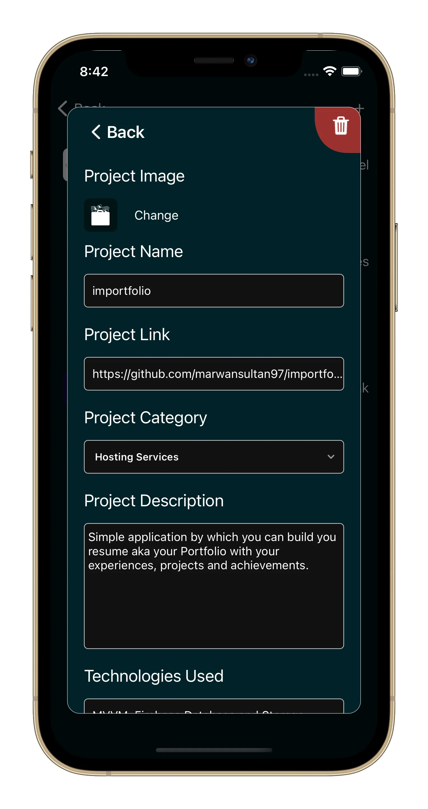
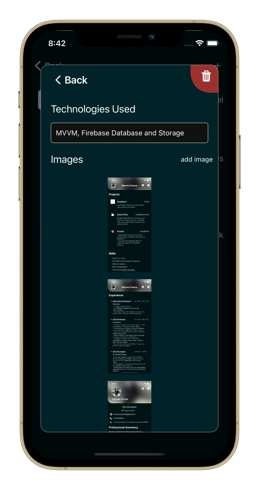
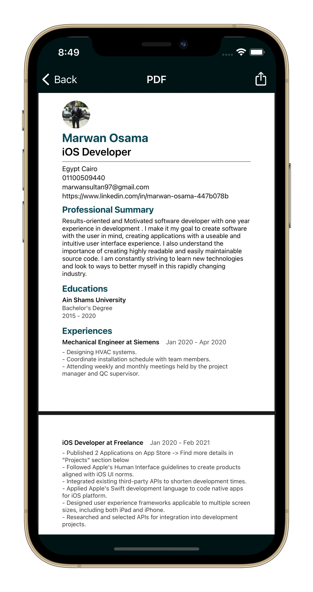

## Importfolio

**Category:** Productivity / Developer Tools

[View on Github →](https://github.com/marwansultan97/importfolio)

  ★
  19
  (Github Stars)

**Importfolio** is an iOS application that allows users to build and manage a professional portfolio directly from their device. The app enables users to organize and present their education, work experience, projects, and achievements in a structured and easy-to-maintain format.

Designed with simplicity and scalability in mind, Importfolio provides a clean interface for managing portfolio data while leveraging cloud-backed storage to keep content consistent and accessible.

---

## 📱 Screenshots {#screenshots}

  
  
  
  
  
  
  
  
  

<section id="tech" class="tech-section">
  <h2>🧰 Technology Stack</h2>
  

    UIKit
    Firebase Realtime Database
    Firebase Firestore
    Firebase Storage
    Firebase Analytics
    MVVM Architecture
  

</section>

<section id="features" class="features-section">
  <h2>⭐ Key Features</h2>
  <ul class="features-list">
    <li>Create and manage professional portfolio content</li>
    <li>Add and edit education, work experience, projects, and achievements</li>
    <li>Cloud-backed data storage and real-time synchronization</li>
    <li>Media and asset storage for portfolio content</li>
    <li>Clean and intuitive UI for fast updates</li>
    <li>Analytics to track feature usage and user engagement</li>
  </ul>
</section>

