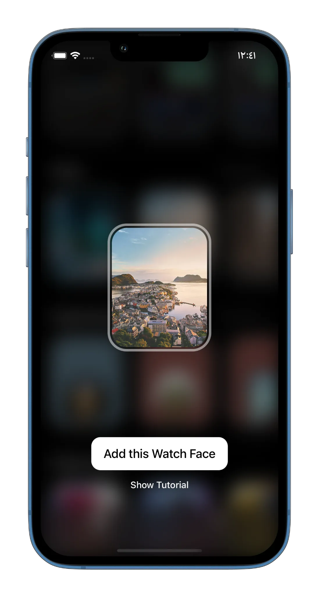
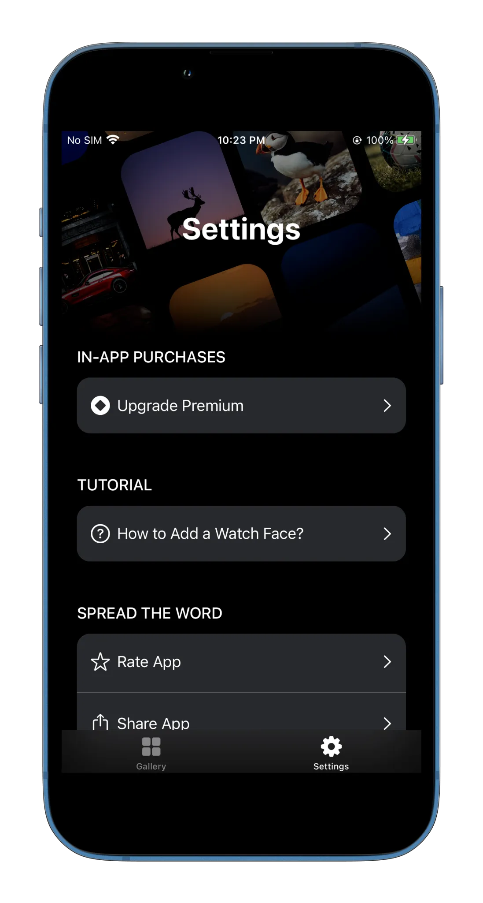
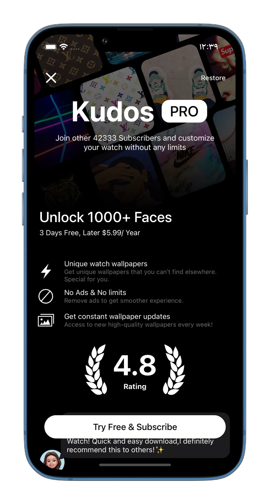
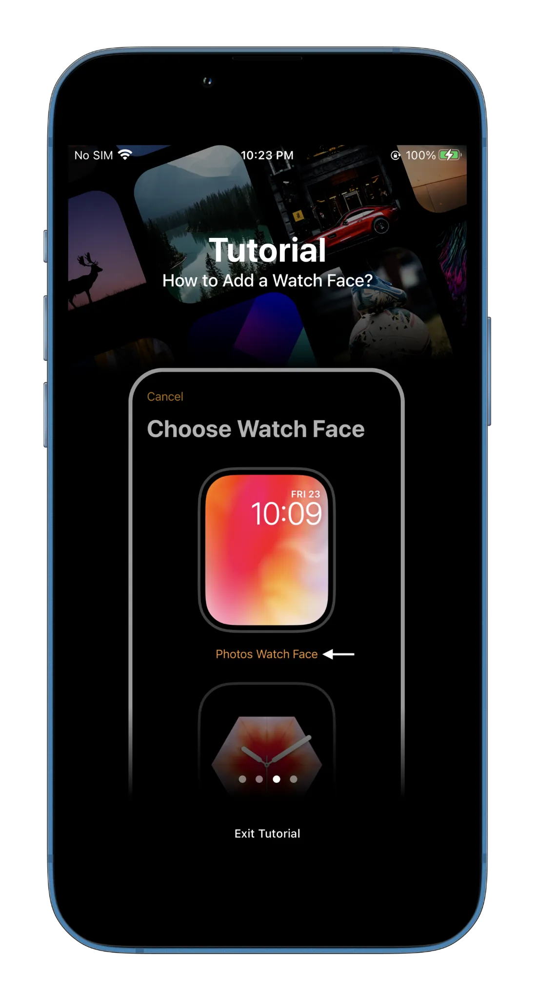

## Watch Faces & Widget Gallery

**Category:** Lifestyle / Personalization

[ View on App Store →](https://apps.apple.com/az/app/watch-faces-widget-gallery/id1617064080)

  ★★★★★
  4.5
  (+12k ratings)

**Watch Faces & Widget Gallery** is a consumer-focused iOS application that allows users to browse, customize, and install Apple Watch faces and widgets with a smooth, few-tap setup experience. The app offers a wide range of professionally designed watch faces, including complication-based layouts, wallpaper-style designs, and animated live-style faces.

Users can personalize their Apple Watch by choosing layouts, colors, complications, or even creating custom faces using their own photos. The app is designed to be fast, intuitive, and accessible, making watch face customization easy for all Apple Watch users.

---

## 📱 Screenshots {#screenshots}

  
  
  
  
  

<section id="tech" class="tech-section">
  <h2>🧰 Technology Stack</h2>
  

    SwiftUI
    Firebase Firestore
    Firebase Storage
    CSV Parsing & Processing
    Firebase Cloud Messaging
    Firebase Analytics
    In-App Purchases
  

</section>

<section id="features" class="features-section">
  <h2>⭐ Key Features</h2>
  <ul class="features-list">
    <li>Thousands of curated Apple Watch face designs</li>
    <li>Few-tap installation with a seamless setup flow</li>
    <li>Complication-based faces with activity, battery, weather, date, and more</li>
    <li>Wallpaper-style faces for a clean, minimal look</li>
    <li>Live-style faces with motion elements</li>
    <li>Full-screen previews before installation</li>
    <li>Category-based browsing and collections</li>
    <li>Color, layout, and style customization</li>
    <li>Create custom watch faces using personal photos</li>
    <li>Free collections with regular content updates</li>
    <li>Support for all Apple Watch models, including Ultra series</li>
  </ul>
</section>

