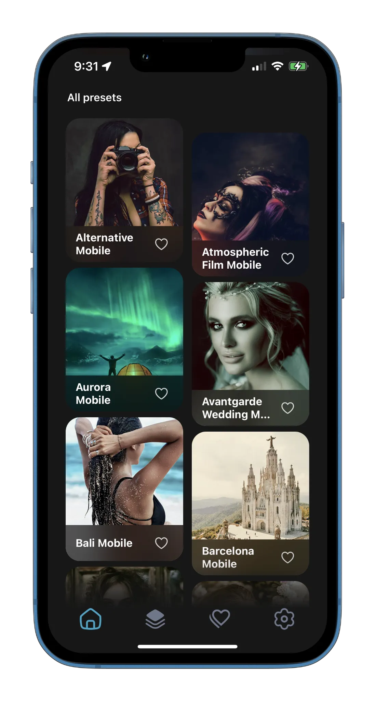
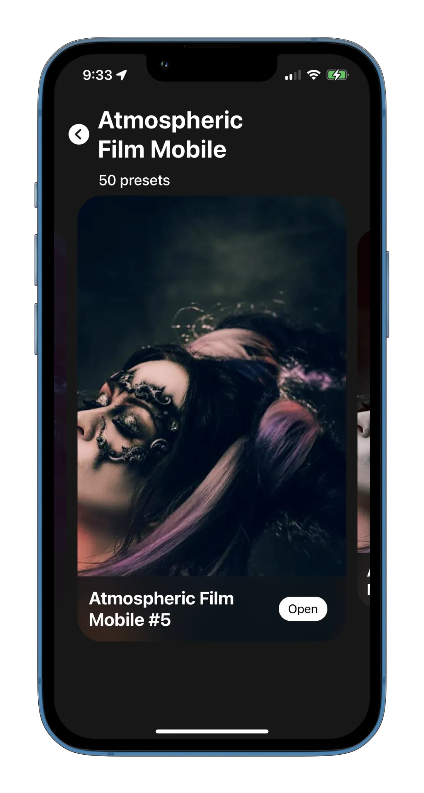
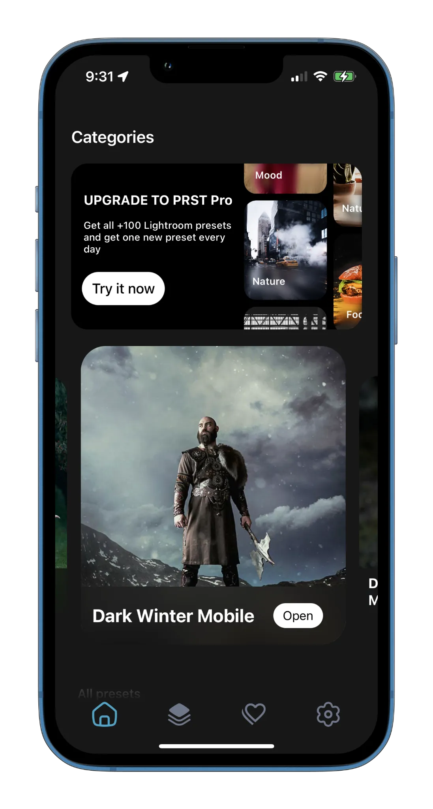
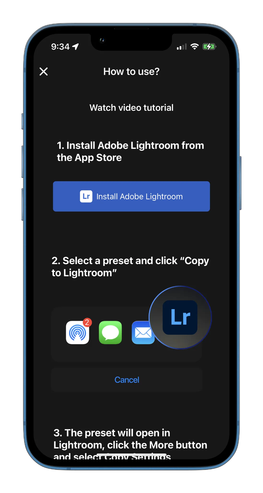
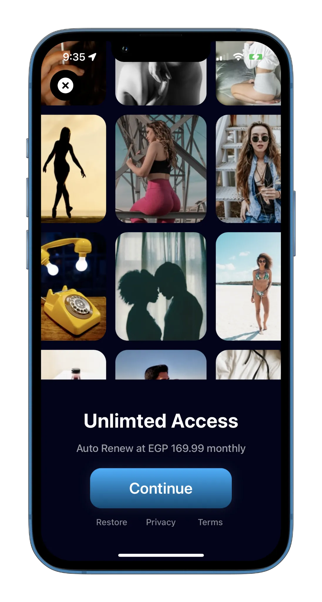

## LRPresets

**Category:** Photography / Creative Tools

**LRPresets** is a photo editing iOS application focused on discovering and applying professional photo preset files. The app allows users to browse preset collections, preview their visual effects, and export selected presets directly into the Lightroom application—enabling consistent photo styling with minimal effort.

Designed for photographers and content creators, LRPresets combines a smooth browsing experience with cloud-backed content delivery and monetization, making professional-grade presets easily accessible on mobile.

---

## 📱 Screenshots {#screenshots}

  
  
  
  
  
  

<section id="tech" class="tech-section">
  <h2>🧰 Technology Stack</h2>
  

    SwiftUI
    Alamofire
    Combine
    Firebase Cloud Messaging
    Firebase Analytics
  

</section>

<section id="features" class="features-section">
  <h2>⭐ Key Features</h2>
  <ul class="features-list">
    <li>Browse curated photo preset collections</li>
    <li>Preview preset effects before applying</li>
    <li>Export preset files directly to Lightroom</li>
    <li>Cloud-based preset delivery and updates</li>
    <li>Push notifications for new preset releases</li>
    <li>Premium preset packs unlocked via in-app purchases</li>
    <li>Analytics-driven insights into user engagement</li>
  </ul>
</section>

