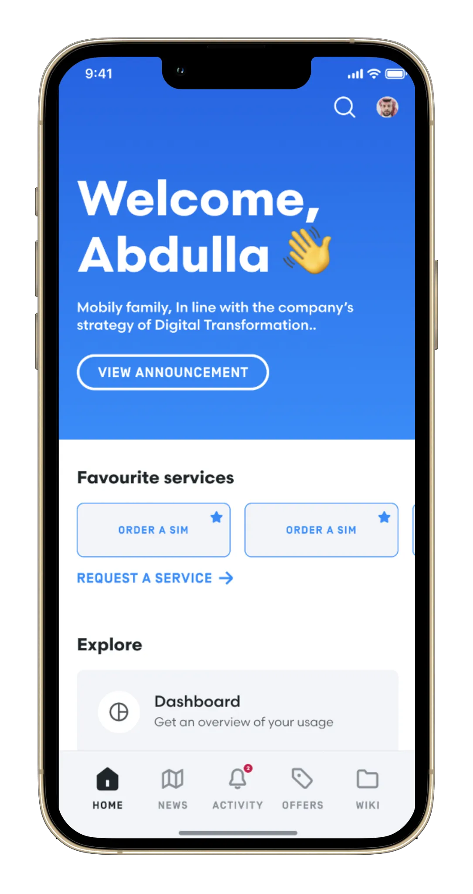
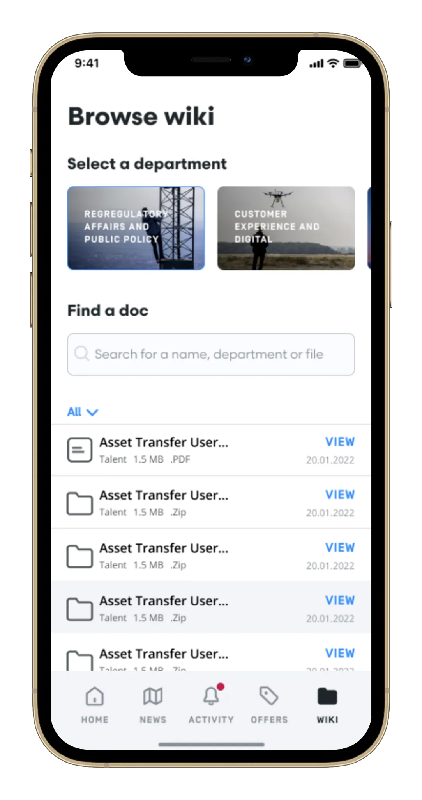
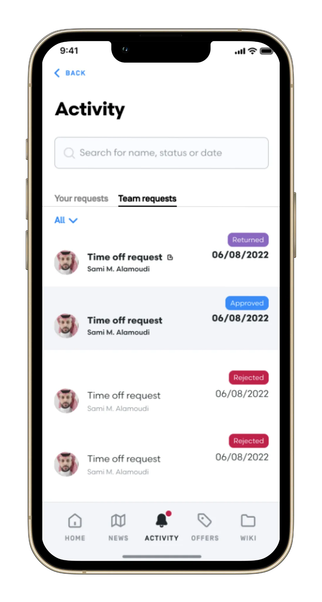
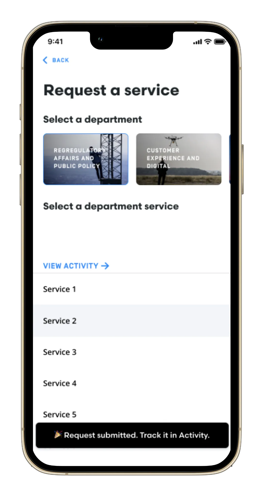

## mCan (Mobily)

**Category:** Enterprise / Telecom

[ View on App Store →](https://apps.apple.com/us/app/mcan/id1607838344)

**mCan** is Mobily’s internal iOS application designed to provide employees with seamless access to essential services and tools anytime, anywhere. The app centralizes service management, task delegation, approvals, internal communications, and employee engagement features into a single mobile platform.

Through mCan, employees can request and approve services, follow company news and events, search internal contacts, submit interest in internship programs, and access exclusive offers—streamlining daily operations and enhancing internal mobility across the organization.

---

## 📱 Screenshots {#screenshots}

  
  
  
  
  

<section id="tech" class="tech-section">
  <h2>🧰 Technology Stack</h2>
  

    UIKit
    Reactive Programming (RxSwift)
    Azure Cloud Messaging
    URLSession / RESTful APIs
    Microsoft Authentication
    Push Notifications
    MVVM / Clean Architecture
    Role-Based Access Control
    Internal Contact Directory
  

</section>

<section id="features" class="features-section">
  <h2>⭐ Key Features</h2>
  <ul class="features-list">
    <li>Requesting and approving internal services</li>
    <li>Task delegation and workflow management</li>
    <li>Permission requests for events and job interviews</li>
    <li>Internal news and company event updates</li>
    <li>Employee address book and contact search</li>
    <li>Internship and co-op program submissions</li>
    <li>Exclusive offers and employee gifts</li>
    <li>Dynamic form-based service interactions</li>
  </ul>
</section>

