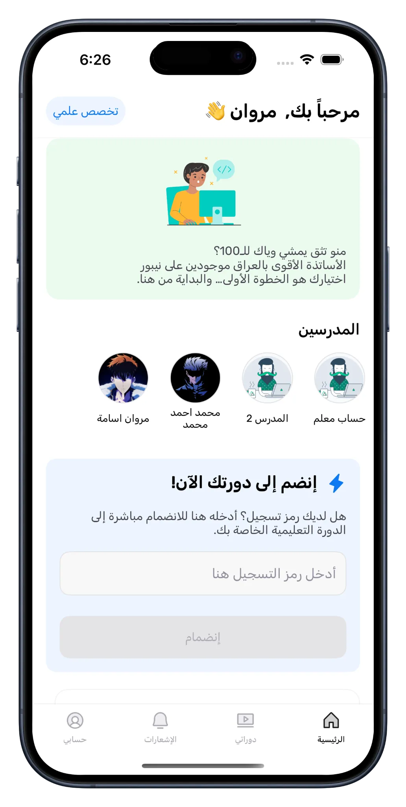
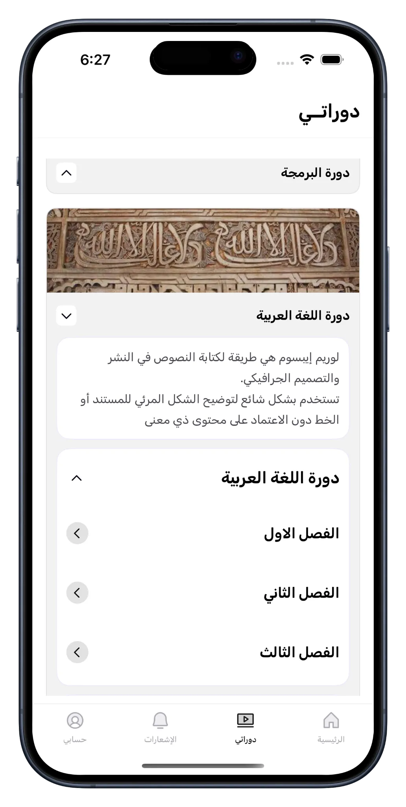
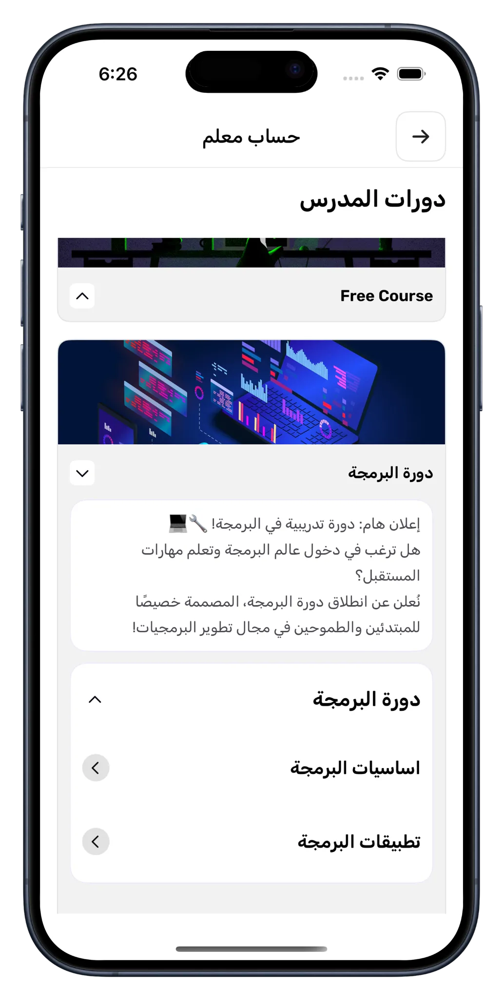
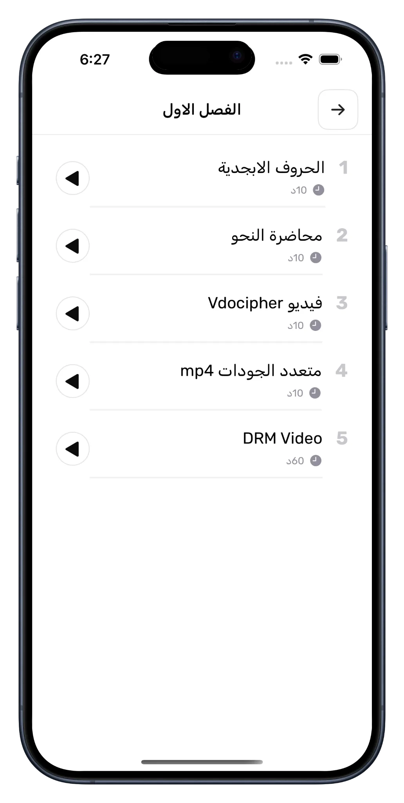
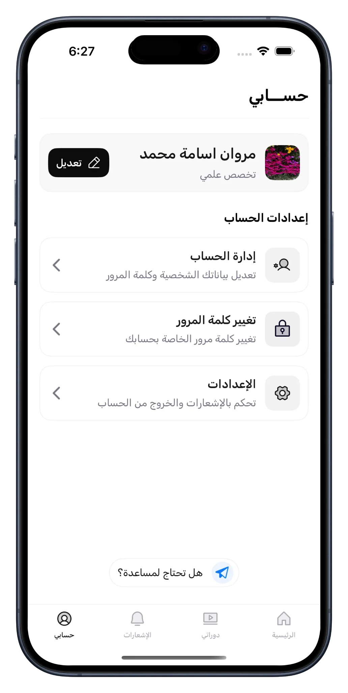
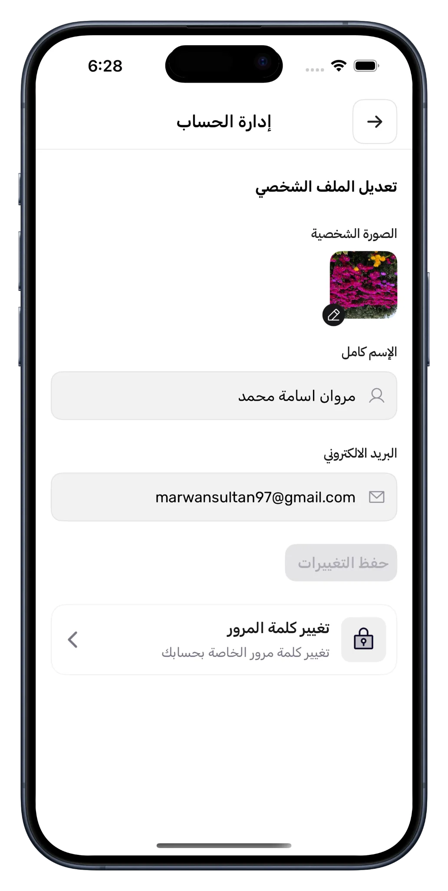
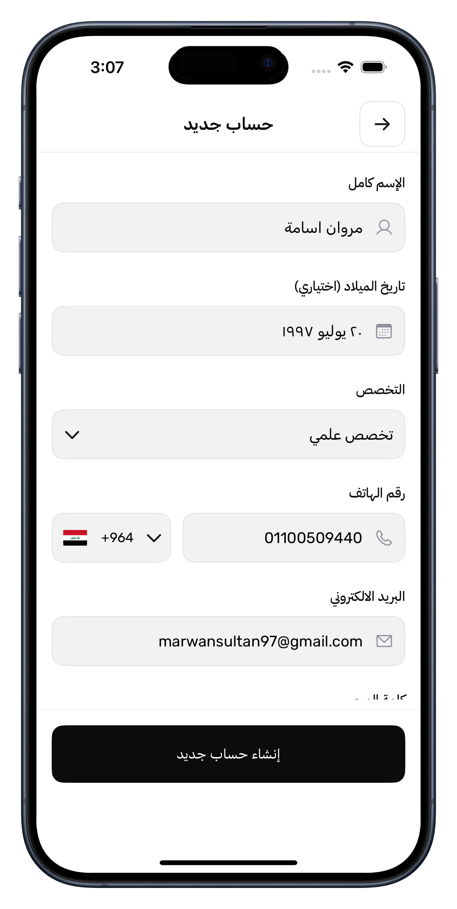
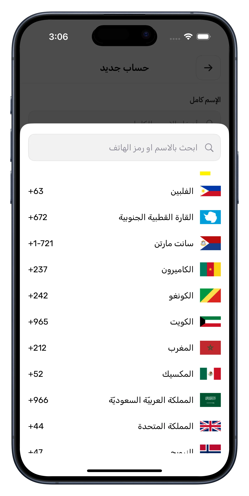

## Nippur Academy

**Category:** Education / E-Learning

[ View on App Store →](https://apps.apple.com/dz/app/nippur-academy-نيبور-أكاديمي/id6745492611)

[🖥️ View on Website →](https://nippuracademy.net/)

**Nippur Academy** is a mobile learning platform designed to deliver structured educational courses through a clean and intuitive iOS experience. The app allows users to browse available courses, access individual lessons, and watch educational content using a custom-built video player optimized for learning workflows.

The platform focuses on smooth navigation, secure content delivery, and high-quality video streaming, offering multiple video quality options to ensure reliable playback across different network conditions.

---

## 📱 Screenshots {#screenshots}

  
  
  
  
  
  
  
  

<section id="tech" class="tech-section">
  <h2>🧰 Technology Stack</h2>
  

    UIKit
    Custom Video Player (AVFoundation)
    VdoCipher
    Multiple Quality Video Selection
    Secure Media Delivery (Encryption & Decryption)
    Asynchronous Programming
    Firebase Cloud Messaging
    URLSession / RESTful APIs
    MVVM / Clean Architecture
  

</section>

<section id="features" class="features-section">
  <h2>⭐ Key Features</h2>
  <ul class="features-list">
    <li>Structured course and lesson browsing</li>
    <li>Secure video streaming for educational content</li>
    <li>Custom-built video player for optimized learning experience</li>
    <li>Multiple video quality selection based on network conditions</li>
    <li>Smooth lesson navigation across different learning paths</li>
    <li>Push notifications for course updates and announcements</li>
    <li>Modular architecture for scalability and maintainability</li>
  </ul>
</section>

