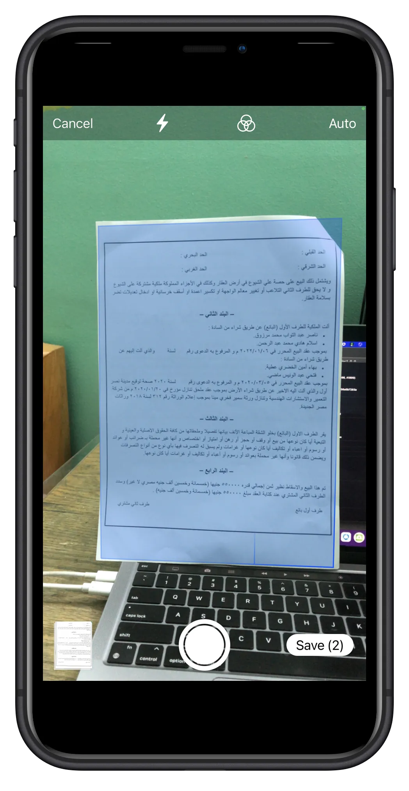
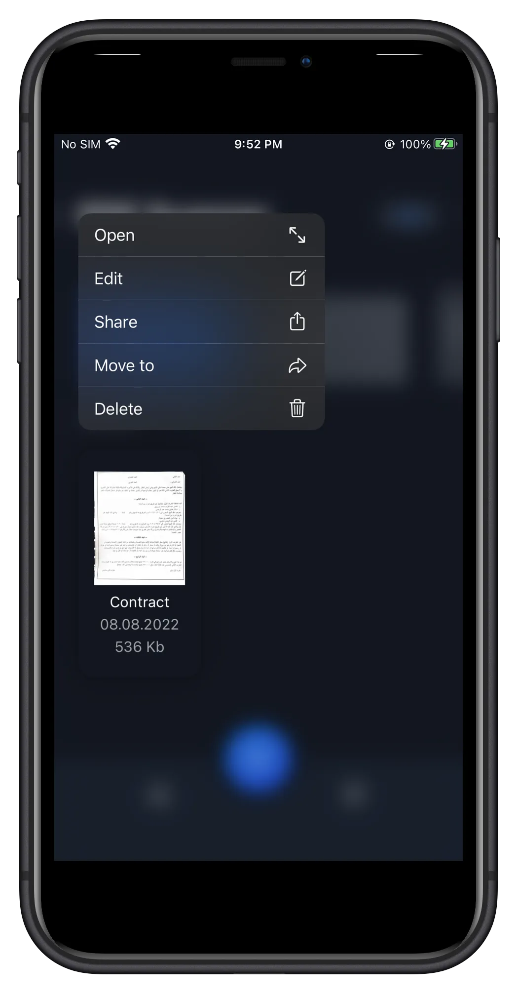
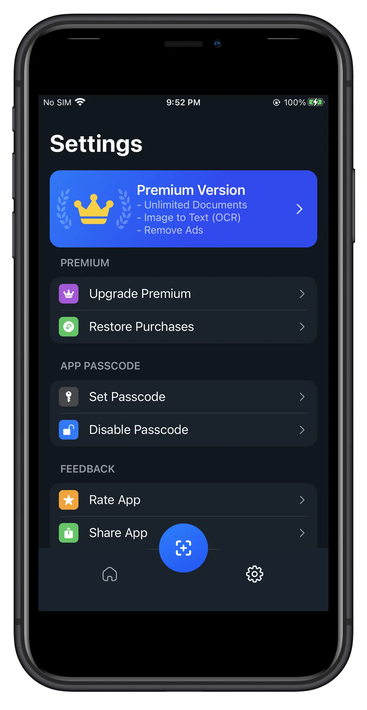
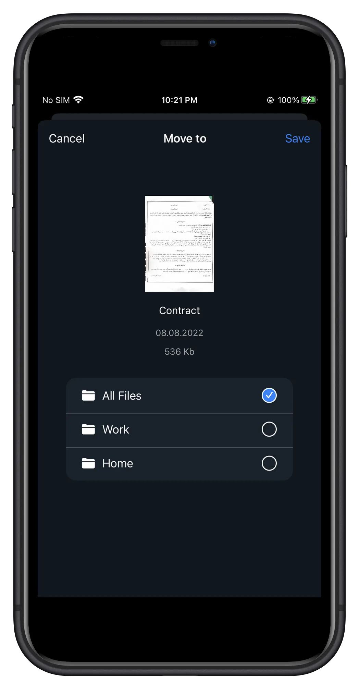

## Scan PDF

**Category:** Productivity / Document Management

[ View on App Store →](https://apps.apple.com/az/app/scan-pdf/id1630384074)

**Scan PDF** is an iOS application that allows users to scan physical documents, enhance captured images, extract text using OCR, and save or share documents as PDFs. The app provides a complete document scanning workflow directly on the device—turning photos into clean, readable, and searchable PDFs.

With built-in image enhancement, cropping, and text recognition, Scan PDF simplifies document digitization for personal and professional use, while offering cloud-backed storage and premium features through in-app purchases.

---

## 📱 Screenshots {#screenshots}

  
  
  
  
  

<section id="tech" class="tech-section">
  <h2>🧰 Technology Stack</h2>
  

    SwiftUI
    VisionKit
    PDFKit
    Image Enhancement & OCR
    Firebase Firestore
    Firebase Storage
    In-App Purchases
    Firebase Cloud Messaging
    Firebase Analytics
  

</section>

<section id="features" class="features-section">
  <h2>⭐ Key Features</h2>
  <ul class="features-list">
    <li>Scan documents using the device camera</li>
    <li>Image enhancement and automatic adjustments</li>
    <li>Crop, rotate, and refine scanned images</li>
    <li>OCR text extraction from images</li>
    <li>Create and manage PDF documents</li>
    <li>Save PDFs locally or to cloud storage</li>
    <li>Share PDFs directly from the app</li>
    <li>Push notifications and usage analytics</li>
    <li>Premium features unlocked via in-app purchases</li>
  </ul>
</section>

  
