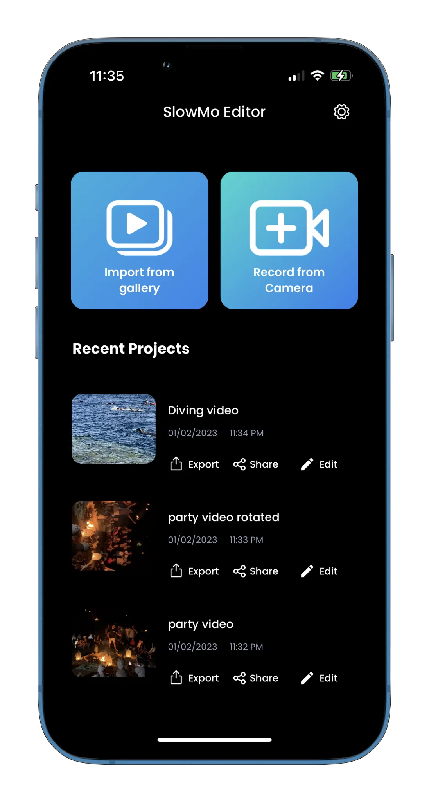
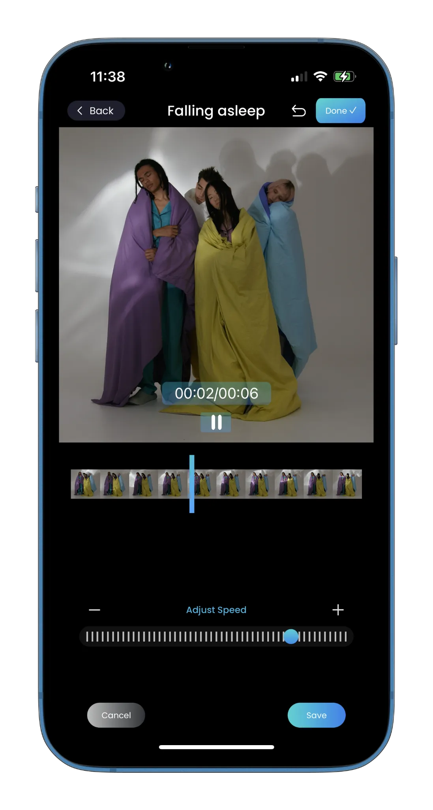
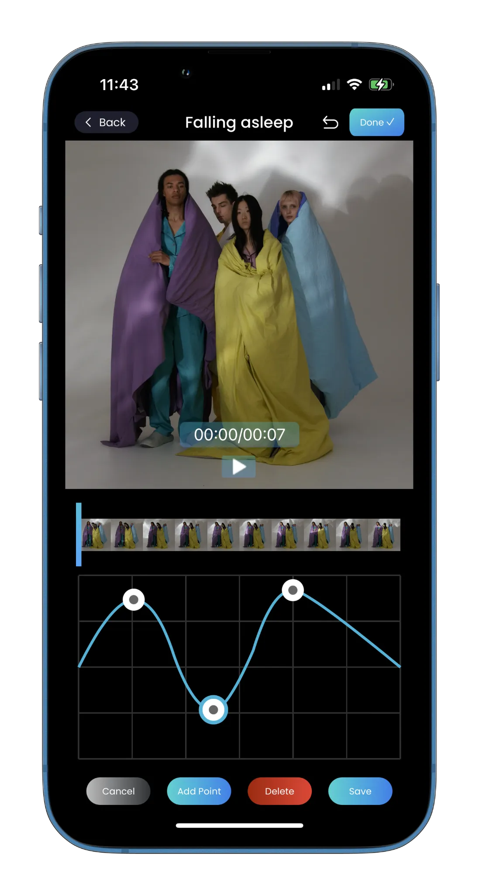
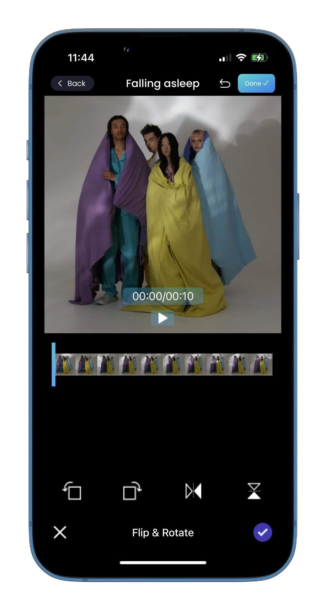
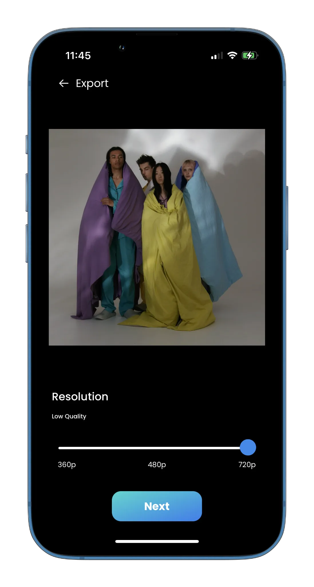

## SlowMo

**Category:** Media / Video Editing

**SlowMo** is a video editing iOS application that allows users to create and edit videos directly on their device. The app provides a full set of editing tools including trimming, cropping, rotating, adding music, and overlaying text—enabling users to produce polished videos with ease.

A key feature of SlowMoVid is its custom speed ramping system, which allows users to apply precise fast or slow motion effects across different sections of a video, giving creators fine-grained control over playback speed and visual impact.

---

## 📱 Screenshots {#screenshots}

  
  
  
  
  
  

<section id="tech" class="tech-section">
  <h2>🧰 Technology Stack</h2>
  

    UIKit
    SwiftUI
    AVFoundation
    Video Editing & Composition
    Multi-Clip Video Merging
    Speed Ramping (Fast & Slow Motion)
    Audio & Video Processing
    Audio & Text Overlays
  

</section>

<section id="features" class="features-section">
  <h2>⭐ Key Features</h2>
  <ul class="features-list">
    <li>Create and edit videos directly on iOS</li>
    <li>Video adjustments: cut, trim, crop, and rotate</li>
    <li>Add background music and text overlays</li>
    <li>Custom speed ramping for fast and slow motion effects</li>
    <li>Smooth timeline-based editing experience</li>
    <li>High-quality video export to iOS devices</li>
    <li>Premium features unlocked via in-app purchases</li>
  </ul>
</section>

