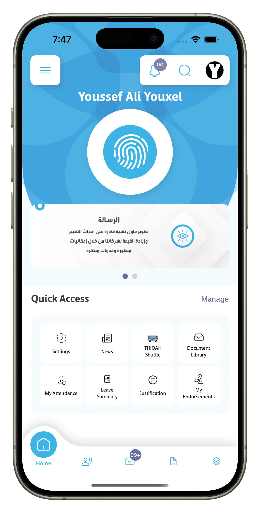
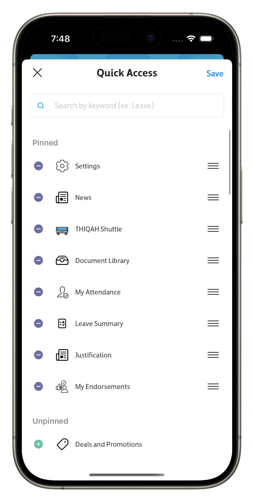
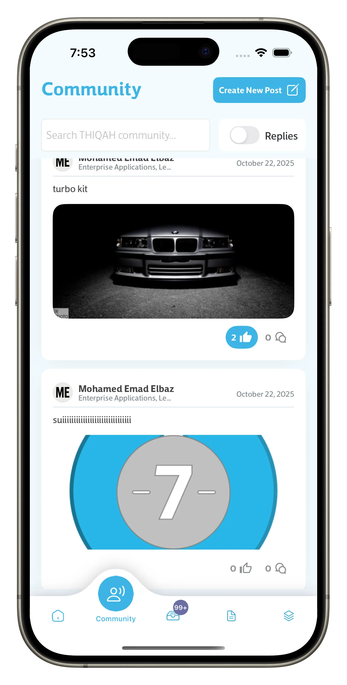
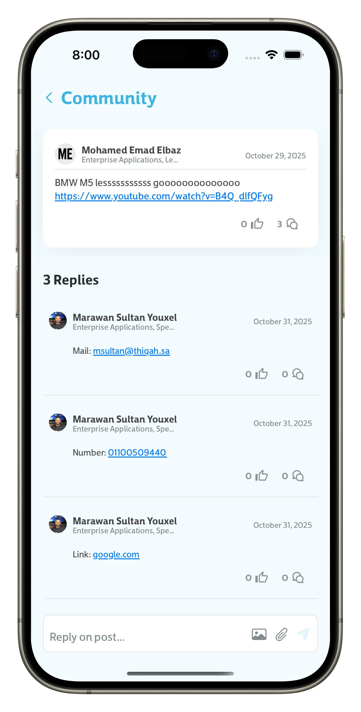
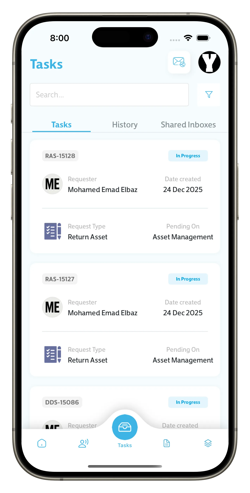
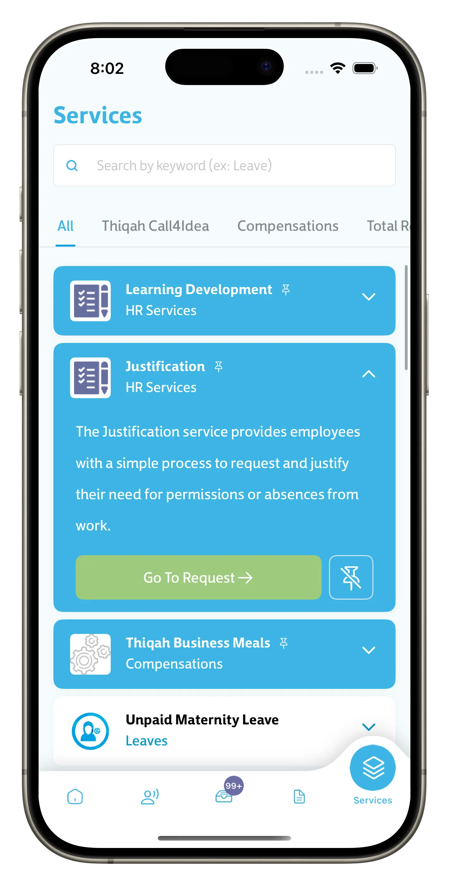
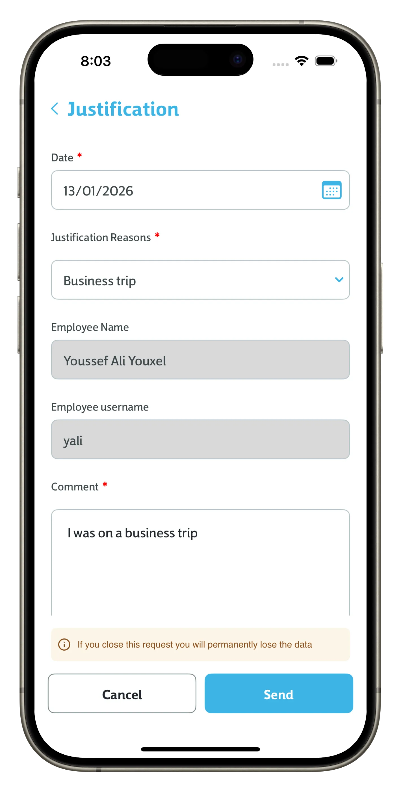
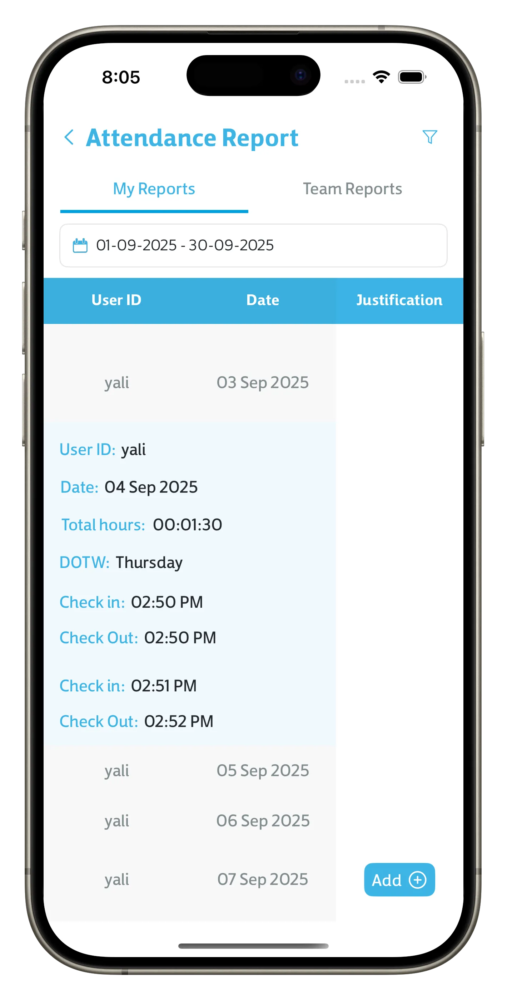
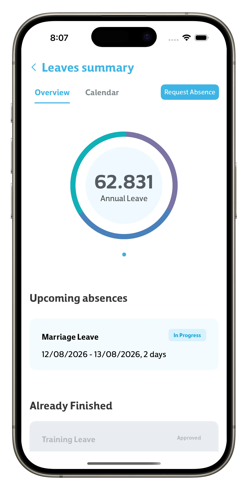
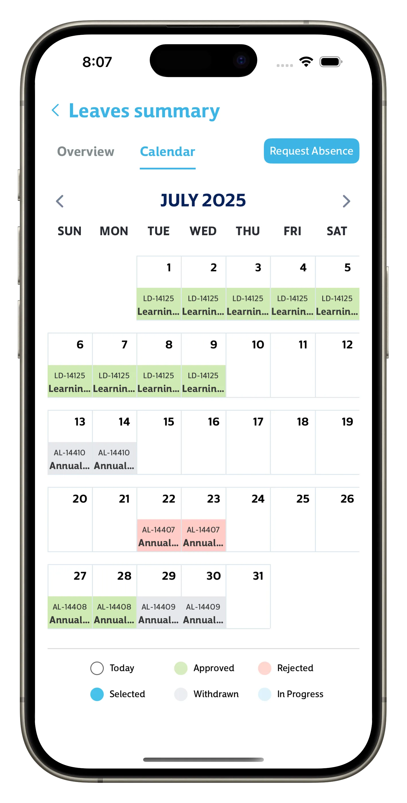

## Thiqati

**Category:** Enterprise Application / Utilities  

[ View on App Store →](https://apps.apple.com/us/app/thiqati/id6468778547)

**Thiqati** is an enterprise-focused iOS application designed to centralize internal company operations and enhance employee engagement. The app provides employees with a single platform to manage attendance, submit service requests, access company documents, and stay informed through centralized updates and announcements.

In addition to operational tools, Thiqati includes collaborative and knowledge-sharing features such as a community feed, a company-wide document library, and an internal application library that provides access to company-approved and licensed tools—including paid applications and AI-based services tailored for internal use.

---

## 📱 Screenshots {#screenshots}

  
  
  
  
  
  
  
  
  
  
  
  

<section id="tech" class="tech-section">
  <h2>🧰 Technology Stack</h2>
  

    UIKit
    Dependency Injection
    Asynchronous Programming
    Azure Cloud Messaging
    URLSession / RESTful APIs
    Microsoft Authentication
    Push Notifications
    MVVM / Clean Architecture
    Role-Based Access Control
  

</section>

---

<section id="features" class="features-section">
  <h2>⭐ Key Features</h2>
  <ul class="features-list">
    <li>Attendance management with check-in / check-out workflows</li>
    <li>Employee service request system with dynamic forms</li>
    <li>Community feed for internal communication and engagement</li>
    <li>Centralized document library for company-wide document access</li>
    <li>Internal application library for company-approved and paid tools (e.g. AI-based services)</li>
    <li>Company announcements, news, and exclusive offers</li>
    <li>Secure authentication and enterprise-grade data privacy</li>
    <li>Modular architecture for scalability and maintainability</li>
  </ul>
</section>

