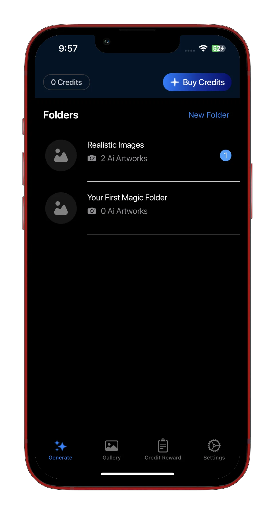
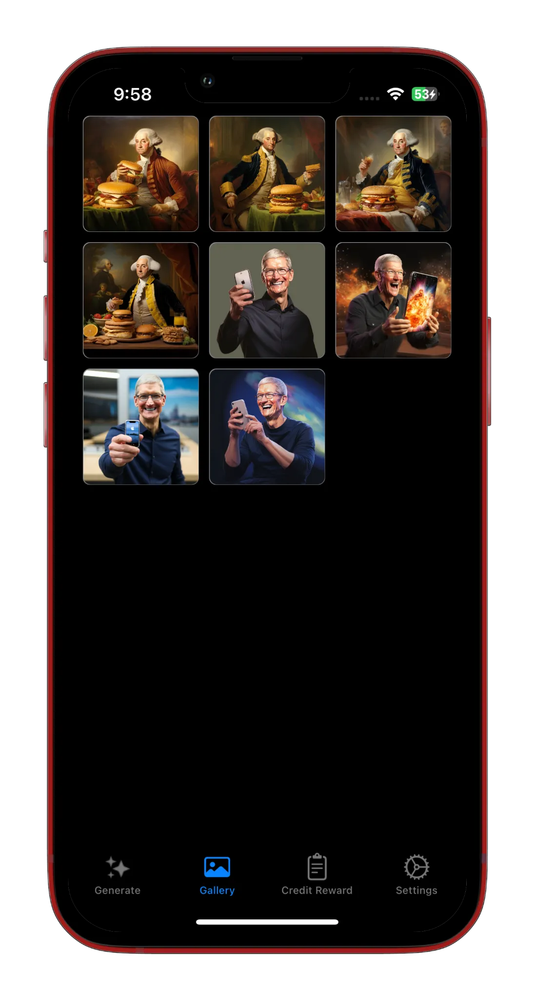
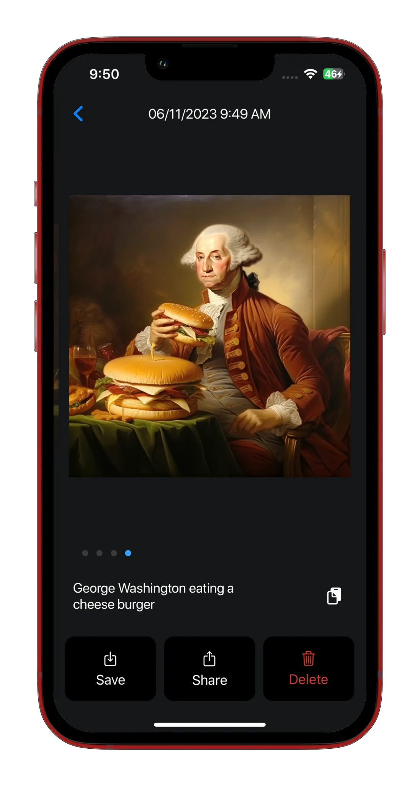
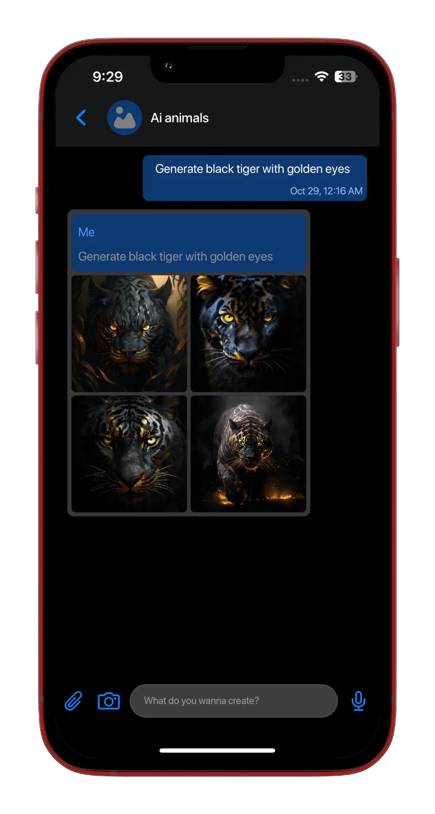
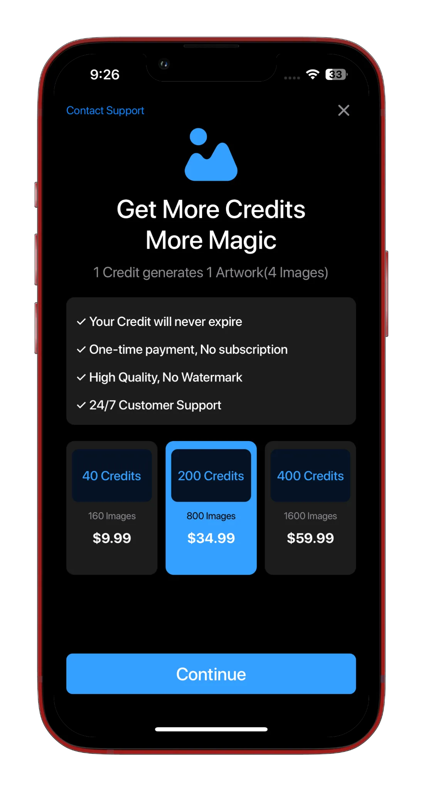
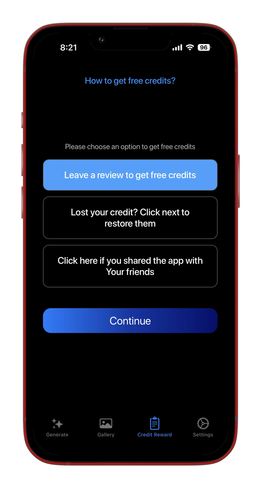
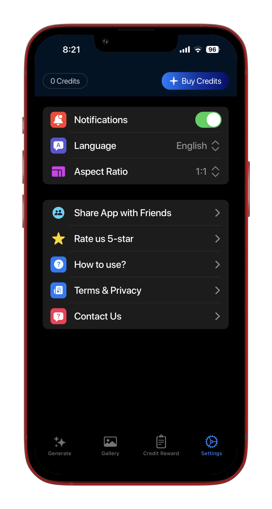

## WhatPhoto – AI Art Generator

**Category:** Consumer / AI & Creativity

[ View on App Store →](https://apps.apple.com/us/app/whatphoto-ai-art-generator/id6466330434)

**AtWork** is a creative iOS application that enables users to transform ideas into visually rich artwork using AI. Users can generate images through text prompts, reference images, or voice memos—making the creative process fast, flexible, and accessible.

The app allows users to refine generated artwork with captions and control the final output by selecting custom aspect ratios optimized for social media platforms, print formats, or personal use. Monetization is handled through in-app purchases, offering premium access to advanced generation capabilities.

---

## 📱 Screenshots {#screenshots}

  
  
  
  
  
  
  
  

  <section id="tech" class="tech-section">
  <h2>🧰 Technology Stack</h2>
  

    UIKit
    Dependency Injection
    AI Image Generation Integration
    Speech Recognition
    Image Processing & Optimization
    URLSession / RESTful APIs
    In-App Purchases
    MVVM / Clean Architecture
    Firebase Analytics
    Firebase Cloud Messaging
  

</section>

<section id="features" class="features-section">
  <h2>⭐ Key Features</h2>
  <ul class="features-list">
    <li>AI-powered image generation from text prompts</li>
    <li>Image generation using reference images</li>
    <li>Voice-based prompt input using speech recognition</li>
    <li>Caption-based refinement of generated artwork</li>
    <li>Custom aspect ratios for social media, print, and personal use</li>
    <li>Image processing and optimization for high-quality outputs</li>
    <li>Premium features unlocked via in-app purchases</li>
    <li>Push notifications and analytics for user engagement insights</li>
  </ul>
</section>

